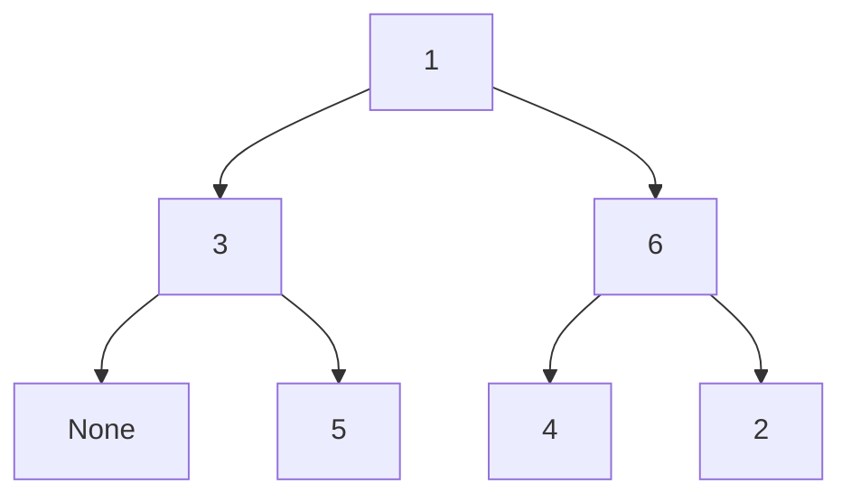

# 参戦メモ
2022-06-11(土) 21:00-22:40

初Rust。4AC-0WA-0TLE。

パフォーマンス 1100で1246→1233 :-\(

## [A \- You should output ARC, though this is ABC\.](https://atcoder.jp/contests/abc255/tasks/abc255_a)
4分AC。初めてRustで本番submit。

`proconio::marker::Usize1` を使うか一瞬迷う。`mut` にする必要がなくなるのでまあ。

タイトルが何かのエラーメッセージみたいで提出時にちょっと焦った。

## [B \- Light It Up](https://atcoder.jp/contests/abc255/tasks/abc255_b)
40分AC。？？

各「明かりを持っていない人」について「最も近くの明かりを持っている人までの距離」を計算して、その最小値。

まず、`Vec`のAに対して
```rust
for i in A {
    //
}
```
みたいに（間違って）書いて、このせいでムーブが起こっていることに気付かず、Rustで書くのをあきらめてC++で書いた。言うまでもなく
```diff
- for i in A.iter() {
+ for i in A.iter() {
```
とする必要がある。

さらに前者と後者の2重ループを逆にすると例1,2が通って、3が通らない状態になり、桁あふれか何かのせいかと思って時間を無駄にした。

## [C \- ±1 Operation 1](https://atcoder.jp/contests/abc255/tasks/abc255_c)
10分AC。

まず交差0のとき $|X-A|$ 。

交差が負の場合、初項を末項で、交差をその $(-1)$ 倍で置き換えて狭義増加列にする。

この列の中で $X$ から最も近い点までの距離が解答。

## [D \- ±1 Operation 2](https://atcoder.jp/contests/abc255/tasks/abc255_d)

25分AC。

Aはソートする。

$A_i \leq X_{j} < A_{i+1}$ のとき、「操作」の回数は

$$
\begin{align*}
\sum_{i=0}^{N-1} |X_j-A_i| =
&X_j - A_0\\
&+X_j - A_0\\
&\vdots\\
&+X_j-A_i\\
&+A_{i+1}-X_j\\
&\vdots\\
&+A_{N-1}-X_j
\end{align*}
$$

で、累積和から計算できる。$i$ は `lower_bound`。

途中混乱して二分探索を書いた。

## [E \- Lucky Numbers](https://atcoder.jp/contests/abc255/tasks/abc255_e)

間に合わず。

$A_0$ が決まれば、

$$
\begin{align*}
    A_1 &= S_0- A_0,\\
    A_2 &= S_1 - A_1 = -S_0 + S_1 + A_0 ,\\
    A_3 &= S_2 - A_2 = S_0 - S_1 + S_2 - A_0,\\
    A_4 &= S_3 - A_3 = -S_0 + S_1 - S_2 + S_3 + A_0,\\
        &\vdots
\end{align*}
$$

と $A_i\,(i\geq 0)$ の値は次々に決まる。つまり、

$$
\begin{align*}
    T_0 &= 0,\\
    T_1 &= S_0,\\
    T_2 &= -S_0 + S_1 ,\\
    T_3 &= S_0 - S_1 + S_2,\\
    T_4 &= -S_0 + S_1 - S_2 + S_3,\\
        &\vdots
\end{align*}
$$

と定義すると、

$$
\begin{align*}
A_i = \left\{
        \begin{array}{cc}
            A_0 + T_i & (i\equiv 0 \mod 2)\\
            -A_0 + T_i & (i\equiv 1 \mod 2)
        \end{array}
    \right..
\end{align*}
$$

だから、$A_0$ をうまく決めてなるべく多くの $A_i$ が $X$ に含まれるようにすればよい。

$A_0$ が決まった場合に $A$ がいくつの $X$ の要素を含むかは、各 $X_i$ について 

($T_{偶数}$ が $X_i-A_0$ をに一致する回数)
+($T_{奇数}$ が $X_i+A_0$ をに一致する回数)

で、の和を取ればよく、$O(M\log(N))$。

$A_0$ の探索範囲が問題だが、少なくともひとつは $X_j = A_i$
となる $(i,j)$ のペアがあるから、候補は $NM \sim 10^6$ に限られる。

合わせて $O(NM^2\log(N))$ で計算できて間に合う。

と実際間に合ったがこれ $10^8$だ。制限4secのところ2.5secでやや危ない。


想定解は $O(NM\log(NM))$ だった。

関連： [068 \- Paired Information（★5）](https://atcoder.jp/contests/typical90/tasks/typical90_bp)

[解説 \- エイシングプログラミングコンテスト2022（AtCoder Beginner Contest 255）](https://atcoder.jp/contests/abc255/editorial/4098)

## [F \- Pre\-order and In\-order](https://atcoder.jp/contests/abc255/tasks/abc255_f)

「行きがけ順」「通りがけ順」が曖昧だったのでいい勉強になった。



↑Memaid記法使ってみた。もっときれいに書く方法がある気はする。

- [mermaid \- Markdownish syntax for generating flowcharts, sequence diagrams, class diagrams, gantt charts and git graphs\.](https://mermaid-js.github.io/mermaid/#/)
- [Include diagrams in your Markdown files with Mermaid \| The GitHub Blog](https://github.blog/2022-02-14-include-diagrams-markdown-files-mermaid/)


```
行きがけ：1 3 5 6 4 2
通りがけ：3 5 1 4 6 2
```

```
行きがけ順=根+行きがけ順(左の部分木)+行きがけ順(右の部分木)
通りがけ順=通りがけ順(左の部分木)+根+通りがけ順(右の部分木)
```

木を左に倒すと行きがけ順で、上下に潰すと通り掛け順。

行きがけ順の先頭が根で、通りがけ順の根の位置と比較すると左の部分木と右の部分木のサイズが分かる。部分木のサイズが0か1になるまで再帰。

グローバルな変数にアクセスする方法で再帰が書けないのが面倒ではあるが、`Result` と `Option` を使うと割ときれいにかけるのがRustの良いところ。


